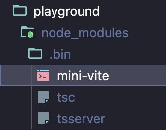

# mini-vite

- 这是一个 vite dev server 最小版本

## 实现功能
- 依赖预构建，包括依赖扫描以及依赖构建
- 插件机制，包括容器对象以及插件上下文
- 核心编译
    - 入口 `html` 加载
    - `tsx, jsx, ts, js` 编译
    - `css`编译
    - 静态资源加载，目前可支持 `svg`引入

## 计划实现
- HMR
    - 服务端
    - 客户端

## 运行
- 进入项目根目录，执行 `pnpm i` 安装依赖
- 执行 `pnpm build` 打包

### 预览效果
- 进入 playground 目录
- 执行 `pnpm i` 安装依赖
    - 执行后，你可以看到 node_modules 中 有一个 bin 目录， bin 目录下 有一个 mini-vite 可执行文件, 则代表 安装成功
    
- 执行 `pnpm dev` , 启动 项目，随后打开浏览器，即可看到效果
